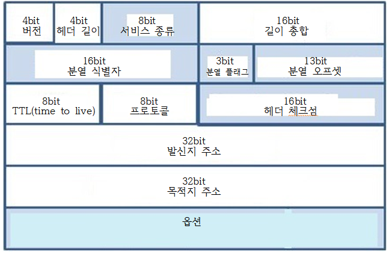
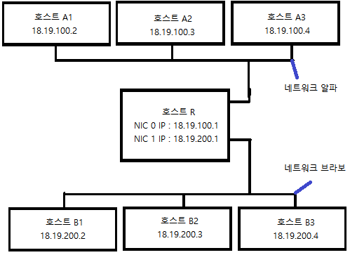
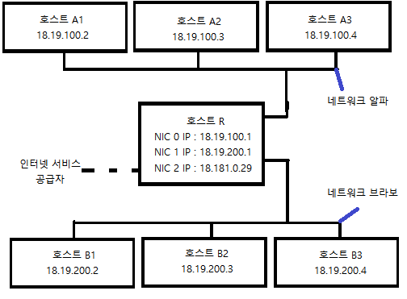
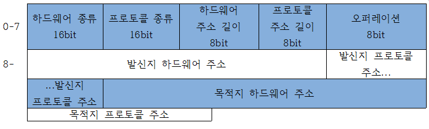

# 멀티 플레이어 게임 프로그래밍
 
## 4. 네트워크 계층(network layer)

- 네트워크 계층의 필요성
  - MAC주소가 하드웨어에 각인되어 유연성이 떨어진다.
  
  - 링크 계층으론 인터넷을 보다 작은 네트워크 망으로 나눌 수 없다.
    - 모든 컴퓨터가 단일망에 연결되어 있어야 한다.
    
    - 이더넷에선 각 프로임을 네트워크상 모든 호스트에 전달해야 한다.
    - 전송자가 애초 의도한 수신자가 바로 자신인지 여부는 호스트 스스로 판단해야 한다.
    - 프레임 하나하나를 보낼 때마다 지구상 연결된 모든 호스트에게 일일이 전달해야 할 것이다.

### IPv4 (Int# 멀티 플레이어 게임 프로그래밍
 
## 4. 네트워크 계층(network layer)

- 네트워크 계층의 필요성
  - MAC주소가 하드웨어에 각인되어 유연성이 떨어진다.
  
  - 링크 계층으론 인터넷을 보다 작은 네트워크로 나눌 수 없다.
    - 모든 컴퓨터가 단일 네트워크에 연결되어 있어야 한다.
    
    - 이더넷에선 각 프로임을 네트워크상 모든 호스트에 전달해야 한다.
    - 발신자는 애초 의도한 수신자가 자신인지 여부를 호스트 스스로 판단해야 한다.
    - 프레임 하나하나를 보낼 때마다 지구상 연결된 모든 호스트에게 일일이 전달해야 할 것이다.

### IPv4 (Internet Protocol version 4)
---
- 네트워크 계층의 역할 수행을 위해 IPv4에선 논리 주소 체계로 각 호스트마다 개별적인 주소를 부여한다.

- 서브넷(subnet)체계로 주소 공간의 논리적 부분 집합을 나누어 물리적 서브 네트워크를 정의하는데 사용한다.
- 라우팅 체계로 서브넷 사이에서 데이터를 서로 전달한다.
- IP주소 
    - 32bit 숫자로, 주로 사람이 알아볼 수 있게 네 개의 8비트 숫자를 마침표로 구분하여 표시한다.
  - ex) 
      - www.use.edu - 128.125.253.146
      - www.mit.edu - 23.193.142.184

#### IPv4 패킷
    
  
    
  그림 4) IPv4 패킷 구조도

- 버전 : 해당 패킷을 지원하는 IP의 버전을 표시한다. ex) IPv4 : 4
- 헤더 길이
  - 사용 값 : 6 ~ 15
    
  - 헤더의 길이를 나타내는 필드이다.
  - IP 헤더 뒷부분에 옵션 필드가 여럿 붙을 수 있으므로 헤더 길이는 가변적이다.
  - 때문에 헤더가 끝나고 이어 포장된 실제 데이터가 시작되는지 나타내 주어야 한다.
  - 헤더는 15개의 32bit워드, 즉 60byte로 되어있다.
  - 헤더는 반드시 20byte의 필수 정보가 포함되어있다. 때문에 해당 필드 값이 5 이하일 일은 없다.
- 서비스 종류 : 혼잡 제어나 서비스 식별자 등 다양한 용도로 사용한다.
- 길이 종합(패킷 길이)
  - 사용 값 : 68 ~ 65,515
    
  - 전체 패킷의 길이를 바이트 단위로 표기한다.
  - 길이는 헤더와 페이로드를 더한 것이다.
  - 헤더의 최소 길이가 20byte이므로 최대 패킷의 길이 65,515byte이다.
- 분열 3종 세트
  - 제한 크기보다 큰 데이터를 보낼 때 이를 분열하여 패킷을 보낸다.
  - 이때 분열된 패킷을 다시 조립하는데 사용된다.
  - 조각난 패킷을 다시 조립할 때도 사용된다.
  - 분열 식별자 
    - 분열된 조각이 원래 어느 패킷에 있었는지 나타내는 숫자이다.
    - 한 패킷에서 쪼개져 나온 모든 조각은 이 필드 값이 같다.
  - 분열 오프셋 필드
    - 오프셋을 8byte 블록 단위로 나타낸다. (8의 배수가 아니면 지정할 수 없다.)
    - 원래 패킷의 시작점부터 이 조각의 위치를 가리킨다.
    - 최대 65,535byte까지의 오프셋이 가능하다.
  - 분열 플래그 필드
    - 마지막 조각을 제외한 모든 조각에 0x04로 지정한다.
    - 이를 MF 플러그(more fragments flag)라고 하는데 아직 남은 조각이 더 있음을 뜻한다. 
- TTL(time to live)
  - 패킷을 전달할 수 있는 횟수 제한을 나타낸다.
- 프로토콜
  - 페이로드의 내용을 어떤 프로토콜로 해석해야 하는지 나타낸다.
- 헤더 체크섬 
  - IPv4 헤더의 무결성을 검증하는데 사용된다.
- 발신지 주소
- 목적지 주소
  - 특수 주솟값을 사용하면 여러 호스트에 동시에 패킷을 보낼 수 있다.

- IPv4 패킷 분열 예제

  | 필드 | 원래 패킷 값 | 첫째 조각의 값 | 둘째 조각의 값 | 째 조각의 값 |
  | :-: | :----------: | :-----------: | :-----------: | :---------: |
  |     필드   | 4 | 4 | 4 | 4 |
  |  헤더 길이  | 20 | 20 | 20 | 20 |
  |  길이 총합  | 3200 | 1500 | 1500 | 60 |
  | 분열 식별자 | 0 | 12 | 12 | 12 |
  | 분열 플래그 | 0 | 0x04 | 0x04 | 0x04 |
  | 분열 오프셋 | 0 | 0 | 185 | 370 |
  |     TTL    | 64 | 64 | 64 | 64 |
  |   프로토콜  | 17 | 17 | 17 | 17 |
  | 발신지 주소 | 10.20.14.1 | 10.20.14.1 | 10.20.14.1 | 10.20.14.1 |
  | 수신지 주소 | 20.30.51.1 | 20.30.51.1 | 20.30.51.1 | 20.30.51.1 |
  |   페이로드  | 3000byte | 1480byte | 1480byte | 40byte |

  표 2) IPv4 패킷 분열 예제
### 직접 라우팅과 주소 결정 프로토콜
---
#### 주소 결정 프로토콜(ARP)
- 네트워크 계층의 IP를 링크 계층의 MAC주소로 변환하는 프로토콜이다.

  
  
그림 3) ARP 패킷 구조도

- 하드웨어 종류 : 링크 계층이 호스트된 하드웨어 종류를 정의한다. ex) 이더넷 : 1

- 프로토콜 종류 : 네트워크 계층 프로토콜의 이더타입 값과 일치한다. ex) IPv4 : 0x0800
- 하드웨어 주소 길이
  - 링크 계층 하드웨어 주소의 길이를 바이트로 나타낸다. 
  - 대부분의 MAC 주소는 6byte이다.
- 오퍼레이션 : 1 또는 2의 값으로, 이 패킷이 정보 요청인지(1), 응답인지(2)를 지정한다.
- 발신지 하드웨어 주소(가변길이) & 발신지 프로토콜 주소(가변주소)
  - 각각 패킷 발신지의 하드웨어 주소 및 네트워크 계층 주소를 나타낸다. 
  - 길이는 앞부분에 명시된 길이 필드와 일치해야 한다.
- 목적지 하드웨어 주소(가변길이) & 목적지 프로토콜 주소(가변주소)
  - 각각 패킷 목적지의 하드웨어 주소 및 네트워크 주소를 나타낸다.
  - 주소 질의를 요청하는 경우, 목적지 하드웨어 주소는 알 수 없는 상태이므로 패킷을 받는 측에선 이 내용을 무시한다.
  - 목적지 프로토콜 주소에 브로드캐스트 주소(FF:FF:FF:FF:FF:FF)를 사용하면 네트워크상 모든 호스트가 이 프레임을 받는다.

- 직접 라우팅 예제

  

  그림 4) 3 대의 호스트로 구성된 네트워크

  |  IP Address |    MAC Address    | 
  | :---------- | :---------------- | 
  | 18.19.200.2 | 01:01:01:00:00:10 | 
  | 18.19.200.3 | 01:01:01:00:00:20 |
  | 18.19.200.4 | 01:01:01:00:00:30 |
  
  표 3) IP 주소를 MAC 주소로 매핑하는 ARP테이블

- B1이 B2에게 데이터를 보내는 과정
  
      1. B2의 IP주소에 대응하는 MAC주소를 ARP테이블에서 찾는다.
      
      2-1. 찾았다면 IP모듈은 해당 MAC주소인 01:01:01:00:00:20을 포함한 링크 프레임을 만들어 이를 링크 계층 모듈에
          전달한다.

      2-2. 찾지 못했다면 ARP모듈이 링크 계층 네트워크에서 도달 가능한 모든 호스트에 ARP패킷을 발신하여 올바른 MAC 주소를 
          찾고자 시도한다.
        (오퍼레이션 필드는 1, 수신자 프로토콜 주소는 B2의 IP주소로 하고, 해당 패킷을 이더넷 프레임에 감싸 수신자 
        MAC주소를 브로드캐스트 주소로 발신한다.)
      1. B3은 수신자 IP주소가 다르므로 응답하지 않는다. 하지만 B2는 같기에 ARP패킷으로 응답한다.
      2. B1은 해당 패킷을 받고 B2에 대한 MAC주소를 갱신하고 이를 가리키던 IP패킷을 이더넷 프레임에 포함하여 B2의
        MAC주소로 보낸다. 
          
### 서브넷과 간접 라우팅
---
#### 서브넷 마스크(subnet mask)
- 32비트의 숫자로서, 4개의 마침표로 구분하여 쓴다.

- IP주소와 AND연산을 한 값이 같으면 같은 서브넷에 있는 것이다.
  
  | 호스트  |   IP주소    | 서브넷 마스크  | IP주소와 서브넷 마스크를 AND한 값 |
  | :----: | :---------: | :-----------: | :---------: |
  |   A1   | 18.100.20.1 | 255.255.255.0 | 18.100.20.0 |
  |   A2   | 18.100.20.2 | 255.255.255.0 | 18.100.20.0 |
  |   B1   | 18.100.10.1 | 255.255.255.0 | 18.100.10.0 |

  표 4) IP 주소와 서브넷 마스크의 예시

  - A1과 A2는 해당 서브넷에서 유효한 IP주소, B1은 별게의 서브넷이다.
- 이진수 형태로 봤을 때 1이 쭉 연결되어있고, 끝나면 모두 0이다.
  
  | 서브넷 마스크 | 서브넷 마스크 이진수 형태 | 상위 비트 수 | 가능한 호스트 개수 |
  | ------------ | ----------------------- | ----------- | ----------------- |
  | 255.255.255.248 | 11111111 11111111  11111111 11111000 | 29 | 6 |
  | 255.255.255.192 | 11111111 11111111 11111111 11000000  | 26 | 62 |
  | 255.255.255.0   | 11111111 11111111  11111111 00000000 | 24 | 254 |
  | 255.255.0.0     | 11111111 11111111  00000000 00000000 | 16 | 65534 |
  | 255.0.0.0       | 11111111 00000000  00000000 00000000 | 8 | 16777214 |
  
  표 5) 서브넷 마스크의 몇 가지 예시

- CIDR(classless inter-domain routing)
  - 서브넷 마스크를 줄여 쓰는 방법이다.

  - 2비트로 표현했을 때 1의 개수를 IP주소 뒤에 /를 쓴 뒤 적는다.

- 간접 라우팅 예제

  
  
  그림 5) 네트워크 알파와 네트워크 브라보를 연결하는 모습

  | 호스트 | 행 번호 |  목적지 서브넷 | 게이트웨이  |         NIC        |
  | :---: | :----: | :------------: | :---------: | :----------------: |
  |   A1  |    1   | 18.19.100.1/24 |             | NIC 0(18.19.100.2) |
  |   A1  |    2   | 18.19.200.2/24 | 18.19.100.1 | NIC 0(18.19.100.2) |
  |       |        |                |             |                    |
  |   B1  |    1   | 18.19.200.2/24 |             | NIC 0(18.19.200.2) |
  |   B1  |    2   | 18.19.100.1/24 | 18.19.200.1 | NIC 0(18.19.200.2) |
  |       |        |                |             |                    |
  |   R   |    1   | 18.19.100.1/24 |             | NIC 0(18.19.100.1) |
  |   R   |    2   | 18.19.200.2/24 |             | NIC 1(18.19.200.1) |

  표 6) A1, B1, R의 라우팅 테이블

- A1이 B1에 패킷을 전달하는 과정

      1. A1이 발신자 주소 18.19.100.2, 수신자 주소 18.19.200.2로 IP패킷을 만든다.
      
      2. A1의 IP모듈은 라우팅 테이블을 한 줄씩 순차적으로 훑어가다, 18.19.200.2를 포함하는 목적지 서브넷 항목 중 
        첫 번째 것을 찾는다. 이번 경우엔 제2행이 될 것이다. 

      (같은 주소가 동시에 여러 항목에 대응 될 수 있으므로, 테이블상 항목 순서가 중요하다는 것을 알아두자)

      1. 제 2행에 등록된 게이트웨이 주소는 18.19.100.1이다. 따라서 A1은 APR와 이더넷 모듈을 이용해 패킷을 이더넷 
        프레임으로 구려, IP 주소 18.19.100.1에 해당하는 MAC 주소를 가진 호스트로 발신한다. 이 패킷은 곧 R에 도착한다.
      
      2. R의 NIC 0번, 곧 18.19.100.1인 이더넷 모듈은, 프레임을 받아 그 페이로드가 IP 패킷임을 감지하고 IP 모듈에
        올려보낸다.
      
      3. R의 NIC 0번, 곧 IP 주소가 18.19.100.1인 인터넷 모듈은 프레임을 받아 그 페이로드가 IP패킷임을 감지하고 IP모듈에
        올려보낸다.
      
      4. R의 IP 모듈은 패킷 주소가 18.19.200.2를 포함하는 서브넷 항목을 라우팅 테이블에서 찾는다. 이번 경우에 제2행이 
        해당된다.
      
      5. 제 2행엔 게이트웨이가 없으므로, 직접 도달이 가능하다. 그런데 이번엔 NIC 칼럼이 18.19.200.1인 NIC 1을 가리키고 
        있다. NIC 1은 네트워크 브라보에 연결되어있다.
      
      6. R의 IP모듈 NIC 모듈은 NIC 1에서 구동중인 이더넷 모듈에 패킷을 넘겨준다. IP 모듈은 APR와 이더넷 모듈을 이용해 
        패킷을 이더넷 프레임으로 꾸려 IP 주소 18.19.200.2에 해당되는 MAC주소를 가진 호스트로 발신한다.
      
      7. B1의 이더넷 모듈이 프레임을 받아, 그 페이로드가 IP패킷임을 감지하고 IP 모듈에 올려보낸다.
      
      8. B1의 IP 모듈은 수신자 IP 주소가 자기 것임을 확인한다. 이제 상위 계층에서 계속 처리할 수 있도록 페이로드의 내용 
         윗 계층으로 올려보낸다.
   
  
  
  그림 6) 인터넷에 연결된 네트워크 알파와 네트워크 브라보를 연결하는 모습

  | 호스트 | 행 번호 |  목적지 서브넷 | 게이트웨이  |         NIC        |
  | :---: | :----: | :------------: | :---------: | :----------------: |
  |   A1  |    1   | 18.19.100.1/24 |             | NIC 0(18.19.100.2) |
  |   A1  |    2   | 18.19.200.2/24 | 18.19.100.1 | NIC 0(18.19.100.2) |
  |   A1  |    3   |    0.0.0.0/0   | 18.19.100.1 | NIC 0(18.19.100.2) |
  |       |        |                |             |                    |
  |   B1  |    1   | 18.19.200.2/24 |             | NIC 0(18.19.200.2) |
  |   B1  |    2   | 18.19.100.1/24 | 18.19.200.1 | NIC 0(18.19.200.2) |
  |   B1  |    3   |    0.0.0.0/0   | 18.19.200.1 | NIC 0(18.19.200.2) |
  |       |        |                |             |                    |
  |   R   |    1   | 18.19.100.1/24 |             | NIC 0(18.19.100.1) |
  |   R   |    2   | 18.19.200.2/24 |             | NIC 1(18.19.200.1) |
  |   R   |    3   | 18.181.0.0/24  | 18.181.0.1  | NIC 2(18.181.0.29) |
  |   R   |    4   |   0.0.0.0/0    | 18.181.0.1  | NIC 2(18.181.0.29) |
  
  표 7) 인터넷 접근이 가능한 A1, B1, R의 라우팅 테이블
ernet Protocol version 4)
---
- 네트워크 계층의 역할 수행을 위해 IPv4에선 논리 주소 체계로 각 호스트마다 개별적인 주소를 부여한다.

- 서브넷(subnet)체계로 주소 공간의 논리적 부분 집합을 나누어 물리적 서브 네트워크를 정의하는데 사용한다.
- 라우팅 체계로 서브넷 사이에서 데이터를 서로 전달한다.
- IP주소 
    - 32bit 숫자로, 주로 사람이 알아볼 수 있게 네개의 8비트 숫자를 마침표로 구분하여 표시한다.
  - ex) 
      - www.use.edu - 128.125.253.146
      - www.mit.edu - 23.193.142.184

#### IPv4 패킷
    
  
    
  그림 4) IPv4 패킷 구조도

- 버전 : 해당 패킷을 지원하는 IP의 버전을 표시한다. ex) IPv4 : 4
- 헤더 길이
  - 사용 값 : 6 ~ 15
    
  - 헤더의 길이를 나타내는 필드이다.
  - IP 헤더 뒷부분에 옵션 필드가 여럿 붙을 수 있으므로 헤더 길이는 가변적이다.
  - 때문에 헤더가 끝나고 이어 포장된 실제 데이터가 시작되는지 나타내 주어야 한다.
  - 헤더는 15개의 32bit워드, 즉 60byte로 되어있다.
  - 헤더는 반드시 20byte의 필수 정보가 포함되어있다. 때문에 해당 필드 값이 5 이하일 일은 없다.
- 서비스 종류 : 혼잡 제어나 서비스 식별자 등 다양한 용도로 사용한다.
- 길이 종합(패킷 길이)
  - 사용 값 : 68 ~ 65,515
    
  - 전체 패킷의 길이를 바이트 단위로 표기한다.
  - 길이는 헤더와 페이로드를 더한 것이다.
  - 헤더의 최소 길이가 20byte이므로 최대 패킷의 길이 65,515byte이다.
- 분열 3종 세트
  - 제한 크기보다 큰 데이터를 보낼 때 이를 분열하여 패킷을 보낸다.
  - 이때 분열된 패킷을 다시 조립하는데 사용된다.
  - 조각난 패킷을 다시 조립할 때도 사용된다.
  - 분열 식별자 
    - 분열된 조각이 원래 어느 패킷에 있었는지 나타내는 숫자이다.
    - 한 패킷에서 쪼개져 나온 모든 조각은 이 필드 값이 같다.
  - 분열 오프셋 필드
    - 오프셋을 8byte 블록 단위로 나타낸다. (8의 배수가 아니면 지정할 수 없다.)
    - 원래 패킷의 시작점부터 이 조각의 위치를 가리킨다.
    - 최대 65,535byte까지의 오프셋이 가능하다.
  - 분열 플래그 필드
    - 마지막 조각을 제외한 모든 조각에 0x04로 지정한다.
    - 이를 MF 플러그(more fragments flag)라고 하는데 아직 남은 조각이 더 있음을 뜻한다. 
- TTL(time to live)
  - 패킷을 전달할 수 있는 횟수 제한을 나타낸다.
- 프로토콜
  - 페이로드의 내용을 어떤 프로토콜로 해석해야 하는지 나타낸다.
- 헤더 체크섬 
  - IPv4 헤더의 무결성을 검증하는데 사용된다.
- 발신지 주소
- 목적지 주소
  - 특수 주솟값을 사용하면 여러 호스트에 동시에 패킷을 보낼 수 있다.

- IPv4 패킷 분열 예제

  | 필드 | 원래 패킷 값 | 첫째 조각의 값 | 둘째 조각의 값 | 째 조각의 값 |
  | :-: | :----------: | :-----------: | :-----------: | :---------: |
  |     필드   | 4 | 4 | 4 | 4 |
  |  헤더 길이  | 20 | 20 | 20 | 20 |
  |  길이 총합  | 3200 | 1500 | 1500 | 60 |
  | 분열 식별자 | 0 | 12 | 12 | 12 |
  | 분열 플래그 | 0 | 0x04 | 0x04 | 0x04 |
  | 분열 오프셋 | 0 | 0 | 185 | 370 |
  |     TTL    | 64 | 64 | 64 | 64 |
  |   프로토콜  | 17 | 17 | 17 | 17 |
  | 발신지 주소 | 10.20.14.1 | 10.20.14.1 | 10.20.14.1 | 10.20.14.1 |
  | 수신지 주소 | 20.30.51.1 | 20.30.51.1 | 20.30.51.1 | 20.30.51.1 |
  |   페이로드  | 3000byte | 1480byte | 1480byte | 40byte |

  표 2) IPv4 패킷 분열 예제
### 직접 라우팅과 주소 결정 프로토콜
---
#### 주소 결정 프로토콜(ARP)
- 네트워크 계층의 IP를 링크 계층의 MAC주소로 변환하는 프로토콜이다.

  
  
그림 3) ARP 패킷 구조도

- 하드웨어 종류 : 링크 계층이 호트크된 하드웨어 종류를 정의한다. ex) 이더넷 : 1

- 프로토콜 종류 : 네트워크 계층 프로토콜의 이더타입 값과 일치한다. ex) IPv4 : 0x0800
- 하드웨어 주소 길이
  - 링크 계층 하드웨어 주소의 길이를 바이트로 나타낸다. 
  - 대부분의 MAC 주소는 6byte이다.
- 오퍼레이션 : 1 또는 2의 값으로, 이 패킷이 정보 요청인지(1), 응답인지(2)를 지정한다.
- 발신지 하드웨어 주소(가변길이) & 발신지 프로토콜 주소(가변주소)
  - 각각 패킷 발신지의 하드웨어 주소 및 네트워크 계층 주소를 나타낸다. 
  - 길이는 앞부분에 명시된 길이 필드와 일치해야 한다.
- 목적지 하드웨어 주소(가변길이) & 목적지 프로토콜 주소(가변주소)
  - 각각 패킷 목적지의 하드웨어 주소 및 네트워크 주소를 나타낸다.
  - 주소 질의를 요청하는 경우, 목적지 하드웨어 주소는 알 수 없는 상태이므로 패킷을 받는 측에선 이 내용을 무시한다.
  - 목적지 프로토콜 주소에 브로드캐스트 주소(FF:FF:FF:FF:FF:FF)를 사용하면 네트워크상 모든 호스트가 이 프레임을 받는다.

- 직접 라우팅 예제

  

  그림 4) 3 대의 호스트로 구성된 네트워크

  |  IP Address |    MAC Address    | 
  | :---------- | :---------------- | 
  | 18.19.200.2 | 01:01:01:00:00:10 | 
  | 18.19.200.3 | 01:01:01:00:00:20 |
  | 18.19.200.4 | 01:01:01:00:00:30 |
  
  표 3) IP 주소를 MAC 주소로 매핑하는 ARP테이블

- B1이 B2에게 데이터를 보내는 과정
  
      1. B2의 IP주소에 대응하는 MAC주소를 ARP테이블에서 찾는다.
      
      2-1. 찾았다면 IP모듈은 해당 MAC주소인 01:01:01:00:00:20를 포함한 링크 프레임을 만들어 이를 링크 계층 모듈에
          전달한다.

      2-2. 찾지 못했다면 ARP모듈이 링크 계층 네트워크에서 도달 가능한 모든 호스트에 ARP패킷을 발신하여 올바른 MAC 주소를 
          찾고자 시도한다.
        (오퍼레이션 필드는 1, 수신자 프로토콜 주소는 B2의 IP주소로 하고, 해당 패킷을 이더넷 프레임에 감싸 수신자 
        MAC주소를 브로드캐스트 주소로 발신한다.)
      1. B3는 수신자 IP주소가 다르므로 응답하지 않는다. 하지만 B2는 같기에 ARP패킷으로 응답한다.
      2. B1는 해당 해킷을 받고 B2에 대한 MAC주소를 갱신하고 이를 가리키던 IP패킷을 이더넷 프레임에 포함하여 B2의
        MAC주소로 보낸다. 
          
### 서브넷과 간접 라우팅
---
#### 서브넷 마스크(subnet mask)
- 32비트의 숫자로서, 4개의 마침표로 구분하여 쓴다.

- IP주소와 AND연산을 한 값이 같으면 같은 서브넷에 있는 것이다.
  
  | 호스트  |   IP주소    | 서브넷 마스크  | IP주소와 서브넷 마스크를 AND한 값 |
  | :----: | :---------: | :-----------: | :---------: |
  |   A1   | 18.100.20.1 | 255.255.255.0 | 18.100.20.0 |
  |   A2   | 18.100.20.2 | 255.255.255.0 | 18.100.20.0 |
  |   B1   | 18.100.10.1 | 255.255.255.0 | 18.100.10.0 |

  표 4) IP 주소와 서브넷 마스크의 예시

  - A1과 A2는 해당 서브넷에서 유효한 IP주소, B1는 별게의 서브넷이다.
- 이진수 형태로 봤을때 1이 쭉 연결되어있고, 끝나면 모두 0이다.
  
  | 서브넷 마스크 | 서브넷 마스크 이진수 형태 | 상위 비트 수 | 가능한 호스트 개수 |
  | ------------ | ----------------------- | ----------- | ----------------- |
  | 255.255.255.248 | 11111111 11111111  11111111 11111000 | 29 | 6 |
  | 255.255.255.192 | 11111111 11111111 11111111 11000000  | 26 | 62 |
  | 255.255.255.0   | 11111111 11111111  11111111 00000000 | 24 | 254 |
  | 255.255.0.0     | 11111111 11111111  00000000 00000000 | 16 | 65534 |
  | 255.0.0.0       | 11111111 00000000  00000000 00000000 | 8 | 16777214 |
  
  표 5) 서브넷 마스크의 몇 가지 예시

- CIDR(classless inter-domain routing)
  - 서브넷 마스크를 줄여쓰는 방법이다.

  - 2비트로 표현했을때 1의 갯수를 IP주소 뒤에 /를 쓴뒤 적는다.

- 간접 라우팅 예제

  
  
  그림 5) 네트워크 알파와 네트워크 브라보를 연결하는 모습

  | 호스트 | 행 번호 |  목적지 서브넷 | 게이트 웨이  |         NIC        |
  | :---: | :----: | :------------: | :---------: | :----------------: |
  |   A1  |    1   | 18.19.100.1/24 |             | NIC 0(18.19.100.2) |
  |   A1  |    2   | 18.19.200.2/24 | 18.19.100.1 | NIC 0(18.19.100.2) |
  |       |        |                |             |                    |
  |   B1  |    1   | 18.19.200.2/24 |             | NIC 0(18.19.200.2) |
  |   B1  |    2   | 18.19.100.1/24 | 18.19.200.1 | NIC 0(18.19.200.2) |
  |       |        |                |             |                    |
  |   R   |    1   | 18.19.100.1/24 |             | NIC 0(18.19.100.1) |
  |   R   |    2   | 18.19.200.2/24 |             | NIC 1(18.19.200.1) |

  표 6) A1, B1, R의 라우팅 테이블

- A1이 B1에 패킷을 전달하는 과정

      1. A1이 발신자 주소 18.19.100.2, 수신자 주소 18.19.200.2로 IP패킷을 만든다.
      
      2. A1의 IP모듈은 라우팅 테이블을 한 줄씩 순차적으로 흝어가다, 18.19.200.2를 포함하는 목적지 서브넷 항목 중 
        첫번째것을 찾는다. 이번 경우엔 제2행이 될 것이다. 

      (같은 주소가 동시에 여러 항목에 대응 될 수 있으므로, 테이블상 항목 순서가 중요하다는 것을 알아두자)

      1. 제 2행에 등록된 게이트웨이 주소는 18.19.100.1이다. 따라서 A1은 APR와 이더넷 모듈을 이용해 패킷을 이더넷 
        프레임으로 구려, IP 주소 18.19.100.1에 해당하는 MAC 주소를 가진 호스트로 발신한다. 이 패킷은 곧 R에 도착한다.
      
      2. R의 NIC 0번, 곧 18.19.100.1인 이더넷 모듈은, 프레임을 받아 그 페이로드가 IP 패킷임을 감지하고 IP 모듈에
        올려보낸다.
      
      3. R의 NIC 0번, 곧 IP 주소가 18.19.100.1인 인터넷 모듈은 프레임을 받아 그 페이로드가 IP패킷임을 감지하고 IP모듈에
        올려보낸다.
      
      4. R의 IP 모듈은 패킷 주소가 18.19.200.2를 포함하는 서브넷 항목을 라우팅 테이블에서 찾는다. 이번 경우에 제2행이 
        해당된다.
      
      5. 제 2행엔 게이트웨이가 없으므로, 직접 도달이 가능하다. 그런데 이번엔 NIC 칼럼이 18.19.200.1인 NIC 1을 가리키고 
        있다. NIC 1은 네트워크 브라보에 연결되어있다.
      
      6. R의 IP모듈 NIC 모듈은 NIC 1에서 구동중인 이더넷 모듈에 패킷을 넘겨준다. IP 모듈은 APR와 이더넷 모듈을 이용해 
        패킷을 이더넷 프레임으로 꾸려 IP 주소 18.19.200.2에 해당되는 MAC주소를 가진 호스트로 발신한다.
      
      7. B1의 이더넷 모듈이 프레임을 받아, 그 페이로드가 IP패킷임을 감지하고 IP 모듈에 올려보낸다.
      
      8. B1의 IP 모듈은 수신자 IP 주소가 자기 것임을 확인한다. 이제 상위 계층에서 계속 처리할 수 잇도록페이로드의 내용 
         윗단 계층으로 올려보낸다.
   
  
  
  그림 6) 인터넷에 연결된 네트워크 알파와 네트워크 브라보를 연결하는 모습

  | 호스트 | 행 번호 |  목적지 서브넷 | 게이트 웨이  |         NIC        |
  | :---: | :----: | :------------: | :---------: | :----------------: |
  |   A1  |    1   | 18.19.100.1/24 |             | NIC 0(18.19.100.2) |
  |   A1  |    2   | 18.19.200.2/24 | 18.19.100.1 | NIC 0(18.19.100.2) |
  |   A1  |    3   |    0.0.0.0/0   | 18.19.100.1 | NIC 0(18.19.100.2) |
  |       |        |                |             |                    |
  |   B1  |    1   | 18.19.200.2/24 |             | NIC 0(18.19.200.2) |
  |   B1  |    2   | 18.19.100.1/24 | 18.19.200.1 | NIC 0(18.19.200.2) |
  |   B1  |    3   |    0.0.0.0/0   | 18.19.200.1 | NIC 0(18.19.200.2) |
  |       |        |                |             |                    |
  |   R   |    1   | 18.19.100.1/24 |             | NIC 0(18.19.100.1) |
  |   R   |    2   | 18.19.200.2/24 |             | NIC 1(18.19.200.1) |
  |   R   |    3   | 18.181.0.0/24  | 18.181.0.1  | NIC 2(18.181.0.29) |
  |   R   |    4   |   0.0.0.0/0    | 18.181.0.1  | NIC 2(18.181.0.29) |
  
  표 7) 인터넷 접근이 가능한 A1, B1, R의 라우팅 테이블
