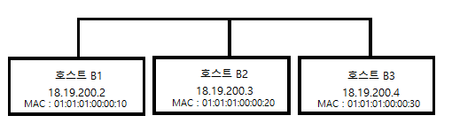

# 멀티 플레이어 게임 프로그래밍
 
## 4. 네트워크 계층(network layer)

- 네트워크 계층의 필요성
  - MAC주소가 하드웨어에 각인되어 유연성이 떨어진다.
  
  - 링크 계층으론 인터넷을 보다 작은 네트워크 망으로 나눌 수 없다.
    - 모든 컴퓨터가 단일망에 연결되어 있어야 한다.
    
    - 이더넷에선 각 프로임을 네트워크상 모든 호스트에 전달해야 한다.
    - 전송자가 애초 의도한 수신자가 바로 자신인지 여부는 호스트 스스로 판단해야 한다.
    - 프레임 하나하나를 보낼 때마다 지구상 연결된 모든 호스트에게 일일이 전달해야 할 것이다.

### IPv4 (Internet Protocol version 4)
- 네트워크 계층의 역할 수행을 위해 IPv4에선 논리 주소 체계로 각 호스트마다 개별적인 주소를 부여한다.

- 서브넷(subnet)체계로 주소 공간의 논리적 부분 집합을 나누어 물리적 서브 네트워크를 정의하는데 사용한다.
- 라우팅 체계로 서브넷 사이에서 데이터를 서로 전달한다.
- IP주소 
    - 32bit 숫자로, 주로 사람이 알아볼 수 있게 네개의 8비트 숫자를 마침표로 구분하여 표시한다.
  - ex) 
      - www.use.edu - 128.125.253.146
      - www.mit.edu - 23.193.142.184

- IPv4 패킷
    
    
    
    그림 3) IPv4 패킷 구조

  - 버전 : 해당 패킷을 지원하는 IP의 버전을 표시한다. ex) IPv4 : 4
  - 헤더 길이
    - 사용 값 : 6 ~ 15
      
    - 헤더의 길이를 나타내는 필드이다.
    - IP 헤더 뒷부분에 옵션 필드가 여럿 붙을 수 있으므로 헤더 길이는 가변적이다.
    - 때문에 헤더가 끝나고 이어 포장된 실제 데이터가 시작되는지 나타내 주어야 한다.
    - 헤더는 15개의 32bit워드, 즉 60byte로 되어있다.
    - 헤더는 반드시 20byte의 필수 정보가 포함되어있다. 때문에 해당 필드 값이 5 이하일 일은 없다.
  - 서비스 종류 : 혼잡 제어나 서비스 식별자 등 다양한 용도로 사용한다.
  - 길이 종합(패킷 길이)
    - 사용 값 : 68 ~ 65,515
      
    - 전체 패킷의 길이를 바이트 단위로 표기한다.
    - 길이는 헤더와 페이로드를 더한 것이다.
    - 헤더의 최소 길이가 20byte이므로 최대 패킷의 길이 65,515byte이다.
  - 분열 식별자, 분열 플래그, 분열 오프셋
    - 분열되거나 조각난 패킷을 다시 조립하는데 사용된다.
  - TTL(time to live)
    - 패킷을 전달할 수 있는 횟수 제한을 나타낸다.
  - 프로토콜
    - 페이로드의 내용을 어떤 프로토콜로 해석해야 하는지 나타낸다.
  - 헤더 체크섬 
    - IPv4 헤더의 무결성을 검증하는데 사용된다.
  - 발신지 주소
  - 목적지 주소
    - 특수 주솟값을 사용하면 여러 호스트에 동시에 패킷을 보낼 수 있다.

### 주소 결정 프로토콜(ARP)
- 네트워크 계층의 IP를 링크 계층의 MAC주소로 변환하는 프로토콜이다.

  
  
  그림 4) ARP 패킷 구조
  
  - 하드웨어 종류 : 링크 계층이 호트크된 하드웨어 종류를 정의한다. ex) 이더넷 : 1

  - 프로토콜 종류 : 네트워크 계층 프로토콜의 이더타입 값과 일치한다. ex) IPv4 : 0x0800
  - 하드웨어 주소 길이
    - 링크 계층 하드웨어 주소의 길이를 바이트로 나타낸다. 
    - 대부분의 MAC 주소는 6byte이다.
  - 오퍼레이션 : 1 또는 2의 값으로, 이 패킷이 정보 요청인지(1), 응답인지(2)를 지정한다.
  - 발신지 하드웨어 주소(가변길이) & 발신지 프로토콜 주소(가변주소)
    - 각각 패킷 발신지의 하드웨어 주소 및 네트워크 계층 주소를 나타낸다. 
    - 길이는 앞부분에 명시된 길이 필드와 일치해야 한다.
  - 목적지 하드웨어 주소(가변길이) & 목적지 프로토콜 주소(가변주소)
    - 각각 패킷 목적지의 하드웨어 주소 및 네트워크 주소를 나타낸다.
    - 주소 질의를 요청하는 경우, 목적지 하드웨어 주소는 알 수 없는 상태이므로 패킷을 받는 측에선 이 내용을 무시한다.

### 서브넷과 간접 라우팅
- 서브넷 마스크(subnet mask)
  - 32비트의 숫자로서, 4개의 마침표로 구분하여 쓴다.
  
  - IP주소와 AND연산을 한 값이 같으면 같은 서브넷에 있는 것이다.
    
    | 호스트 |   IP주소    | 서브넷 마스크 | IP주소와 서브넷 마스크를 AND한 값 |
    | :----: | :---------: | :-----------: | :---------: |
    |   A1   | 18.100.20.1 | 255.255.255.0 | 18.100.20.0 |
    |   A2   | 18.100.20.2 | 255.255.255.0 | 18.100.20.0 |
    |   B1   | 18.100.10.1 | 255.255.255.0 | 18.100.10.0 |

    표 2) IP 주소와 서브넷 마스크의 예시

    - A1과 A2는 해당 서브넷에서 유효한 IP주소, B1는 별게의 서브넷이다.
  - 이진수 형태로 봤을때 1이 쭉 연결되어있고, 끝나면 모두 0이다.
    
    | 서브넷 마스크 | 서브넷 마스크 이진수 형태 | 상위 비트 수 | 가능한 호스트 개수 |
    | ------------ | ----------------------- | ----------- | ----------------- |
    | 255.255.255.248 | 11111111 11111111  11111111 11111000 | 29 | 6 |
    | 255.255.255.192 | 11111111 11111111 11111111 11000000  | 26 | 62 |
    | 255.255.255.0   | 11111111 11111111  11111111 00000000 | 24 | 254 |
    | 255.255.0.0     | 11111111 11111111  00000000 00000000 | 16 | 65534 |
    | 255.0.0.0       | 11111111 00000000  00000000 00000000 | 8 | 16777214 |
    
    표 3) 서브넷 마스크의 몇 가지 예시

#### CIDR(classless inter-domain routing)
- 서브넷 마스크를 줄여쓰는 방법이다.

- 2비트로 표현했을때 1의 갯수를 IP주소 뒤에 /를 쓴뒤 적는다.
- 간접 라우팅 예제

  
  
  그림 5) 알파와 브라보를 연결하는 모습

  | 호스트 | 행 번호 |  목적지 서브넷 | 게이트 웨이  |         NIC        |
  | :---: | :----: | :------------: | :---------: | :----------------: |
  |   A1  |    1   | 18.19.100.1/24 |             | NIC 0(18.19.100.2) |
  |   A1  |    2   | 18.19.200.2/24 | 18.19.100.1 | NIC 0(18.19.100.2) |
  |       |        |                |             |                    |
  |   B1  |    1   | 18.19.100.1/24 | 18.19.200.1 | NIC 0(18.19.100.2) |
  |   B1  |    2   | 18.19.200.2/24 |             | NIC 0(18.19.100.2) |
  |       |        |                |             |                    |
  |   R   |    1   | 18.19.100.1/24 |             | NIC 0(18.19.100.1) |
  |   R   |    2   | 18.19.200.2/24 |             | NIC 1(18.19.200.1) |

  표 4) A1, B1, R의 라우팅 테이블

  - 18.19.100.2에 위치한 A1이 18.19.200.2에 위치한 B1에 패킷을 전달하는 과정
    1. A1이 발신자 주소 18.19.100.2, 수신자 주소 18.19.200.2로 IP패킷을 만든다.
    2. A1의 IP모듈은 라우팅 테이블을 한 줄씩 순차적으로 흝어가다, 18.19.200.2를 포함하는 목적지 서브넷 항목 중 첫번째 것을 찾는다. 이번 경우엔 제2행이 될 것이다. 
   
        (같은 주소가 동시에 여러 항목에 대응 될 수 있으므로, 테이블상 항목 순서가 중요하다는 것을 알아두자)
    3. 제 2행에 등록된 게이트웨이 주소는 18.19.100.1이다. 따라서 A1은 APR와 이더넷 모듈을 이용해 패킷을 이더넷 프레임으로 구려, IP 주소 18.19.100.1에 해당하는 MAC 주소를 가진 호스트로 발신한다. 이 패킷은 곧 R에 도착한다.
    4. R의 NIC 0번, 곧 18.19.100.1인 이더넷 모듈은, 프레임을 받아 그 페이로드가 IP 패킷임을 감지하고 IP 모듈에 올려보낸다.
    5. R의 IP 모듈은 패킷 주소가 19.19.200.2를 포함하는 서브넷 항목을 라우팅 테이블에서 찾는다. 이번 경우에 제2행이 해당된다.