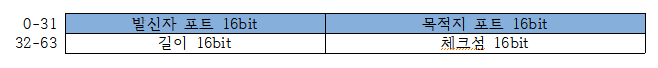
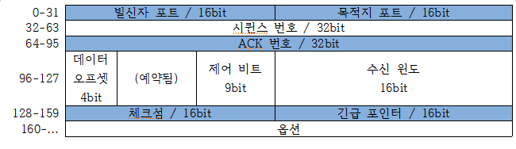
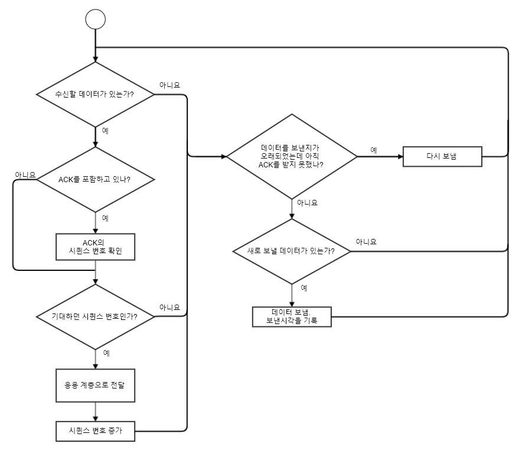

# 멀티 플레이어 게임 프로그래밍

# 2. 네트워크

## 4. 네트워크 계층(network layer)

### IPv6 (Internet Protocol version 6)

- IPv4의 고갈과 여러 문제들을 해소하기 위해 고안되었다.

- IPv6 주소 예시

    | 형식 | 주소 |
    | :- | :- |
    | 줄여 쓰지 않음 | 2001:4a60:0000:08f1:0000:0000:0000:1013 |
    | 각 묶음(hextet)의 앞자리 0을 생략 | 2001:4a60:0:8f1:0:0:0:1013 |
    | 연달아 나오는 0 묶음 생략 | 2001:4a60:0:8f1::1013 |

    표 2-8) IPv6 주소 예시
    

- IPv4와의 차이점

    |   | IPv4 | IPv6 |
    | - | ---- | ---- |
    | 크기 | 32bit | 128bit |
    | 할당할 수 있는 IP주소 개수 | 4,294,967,296 | 340,282,366,920,938,463,463 ,374,607,431,768,211,456 |
    | 링크 계층 변환 프로토콜 | ARP | NDP |

## 5. 전송 계층

- 호스트상 개별 프로세스 사이의 통신을 가능케 한다.
 
- 포트(port)
  - 16bit 부호 없는 숫자로서 특정 호스트의 통신 종담점을 나타낸다.
  
  - 비유 
    - IP : 건물 주소
    
    - Port : 건물 내 입주한 사무실 번호
  - 어떤 프로세스가 특정 포트를 바인딩(Binding)해두면, 전송 계층 모듈은 이후 그 포트로 전달되는 모든 것을 그 프로세스에게 전달해 준다.
  - 중복을 허용하지도 않는다.
  - 1024 ~ 49151 : 사용자 포트(User port) 또는 등록 포트(Registered port)
    - 프로토콜 개발자 혹은 응용프로그램 개발자가 IANA에 이 범위 내에 포트 번호를 요청하면 IANA가 검토 절차 후 등록을 승인한다.
  - 0 ~ 1023 : 시스템 포트(System port) 또는 예약 포트(Reserved port)
    - 사용자 포트보다 더 까다롭고 많은 검토 단계를 통해 등록한다.
    - OS는 이들 포트를 특별히 취급하여 오직 루트 레벨 프로세스만 시스템 포트에 바인딩 할 수 있고, 따라서 높은 보안 등급을 확보해야만 사용할 수 있다.
  - 49152 ~ 65535 : 동적 포트(dynamic port)
    - IANA의 관할 밖이며 어느 프로세스가 쓰던 제약이 없다.
    - 프로세스를 구현할 때 동적 포트에 바인딩을 시도했다가 이미 사용 중인 것을 알게 되면 비어있는 포트를 찾을 때 까지 다른 동적 포트에 바인딩을 시도해야 한다.
- 포트가 정해지면 전송 계층 프로토콜을 통해 실제 데이터를 보낸다.
  
### UDP (User datagram protocol)

---

- 경량 프로토콜로서 데이터를 포장하여 호스트의 어떤 포트에서 다른 호스트의 또 어떤 포트로 전달할 때 사용된다.

- UDP 패킷 구조
    
    
    그림 2-7) UDP 패킷 구조도

  - 발신자 포트 
    - 데이터 그램의 출처가 되는 포트 번호를 기재한다.
    
    - 수신자가 발신자에게 응답하고자 할 때 유용하다.
  - 목적지 포트
    - 데이터 그램의 목적지가 되는 포트 번호를 기재한다.
    
    - UDP모듈은 이 포트에 바인딩 해 둔 프로세스에 데이터 그램을 전달한다.
  - 길이
    - 헤더와 페이로드를 합친 길이를 나타낸다.
  - 체크섬
    - UDP 헤더와 페이로드, 그리고 IP 헤더 몇몇 필드를 엮어 계산한 체크섬 값이다.
    - 필 수 사항은 아니다.

### TCP (Transmission control protocol)

---

- UDP와의 차이

    | | UDP | TCP |
    | :-: | :-: | :-: |
    | 연속성 | 불연속적 | 연속적 |
    | 데이터 신뢰성 | 비신뢰 | 신뢰 |
    | 혼잡제어 & 흐름제어 | x | o |
    | 상태 | 비유지형 | 유지형 |
    | 헤더 크기| 비교적 작음 | 비교적 큼 |
    | 속도 | 비교적 빠름 | 비교적 느림 | 
    | 패킷 단위 | 세그먼트 (segment) | 데이터 그램 (datagram) |
    | 사용범위 | DNS, 멀티미디어 등 | 웹 HTTP통신, 이메일 등 |
- 의도된 수신자에게 모든 데이터를 순서대로 전달하려 최선을 다한다.
  
  이로 인해
  1. UDP에 비해 큰 헤더가 필요하다.
  2. 연결된 호스트마다 간단치 않은 연결 상태 추적 메커니즘이 돌아간다.
 
- TCP 패킷 구조

    

    그림 2-8) TCP 패킷 구조도

    - 발신지 & 수신지 포트 : 전송 계층 포트 번호이다.
   
    - 시퀀스 번호
      - 단조 증가하는 식별 번호이다.
     
      - TCP로 보내는 각 바이트마다 시퀀스 번호가 식별자로 부여한다.
      - 발신자와 수신자는 데이터 전송 중도에 답신을 위한 표식으로 이 번호를 사용한다.
      - 대개 세그먼트의 시퀀스 번호는 세그먼트에 포함된 데이터 첫 바이트의 시퀀스 번호이다.
      - 처음 연결을 맺을 때는 예외적으로 다른 번호가 부여된다.

- 신뢰성
    

    그림 2-9) TCP 신뢰성 데이터 전송 순서도